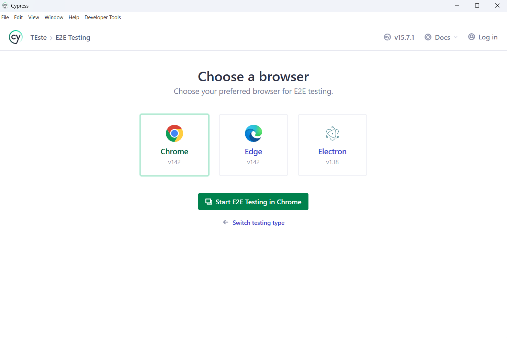
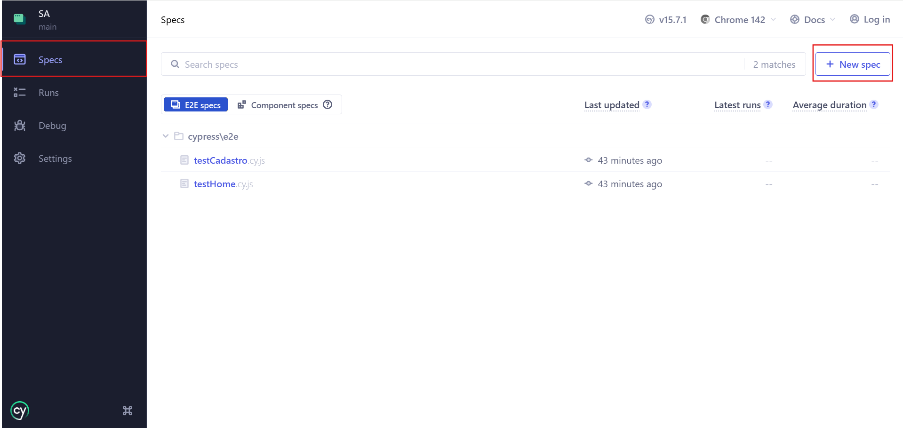
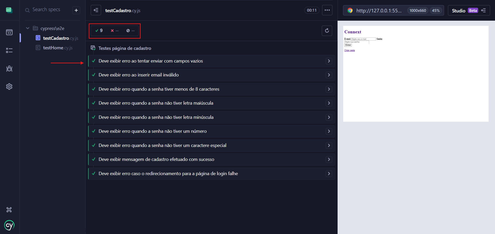

# 📘 SA - Testes de Frontend 

Este repositório é um **projeto de estudo** voltado para o desenvolvimento e prática de **testes de frontend**, com ênfase na criação de um **roteiro completo de testes**, buscando explorar o processo de escrita, organização e execução de testes em diferentes níveis

---

## 🎯 Objetivo

- Aprender conceitos e boas práticas de testes frontend.  
- Criar roteiro de testes para componentes e fluxos da aplicação.  
- Praticar testes com Cypress (E2E e componentes).

---

## 🧪 Tipos de Testes

- **Unitários:** funções, componentes e módulos isolados.  
- **Integração:** interação entre módulos e componentes.  
- **E2E:** simulação do comportamento do usuário, navegação e formulários.

---

## 🚀 Tecnologias

- HTML
- CSS
- JS
- Node.js / npm   
- **Cypress**  

---

## 📝 Requisitos

Antes de começar, certifique-se de ter instalado:

- **Node.js**  
- **npm**  
- **Cypress**

---

## 📦 Instalação

Para iniciar o projeto e configurar o Cypress, siga os passos:

```bash
# Inicializar projeto Node
npm init -y

# Instalar Cypress como dependência de desenvolvimento
npm install cypress --save-dev

# Abrir a interface interativa do Cypress 
npx cypress open

Após abrir a interface do Cypress você deve selecionar o tipo de teste a ser realizado, clicar em continue na página seguinte e selecionar o navegador que deseja utilizar para realizar os testes.




---

🧪 Execução

O Cypress permite testar componentes isolados, fluxos integrados e simular a experiência real do usuário na aplicação, garantindo que todos os comportamentos estejam funcionando corretamente. Para os fins desse projeto faremos apenas testes E2E. 

Após a instalação, para executar os testes usando a interface gráfica do Cypress devemos criar nossa primeira Spec. Para fazer isso basta estar na aba Specs, buscar por new specs no canto superior direito e criar uma nova Spec. 



Selecione a Spec desejada e os testes irão acontecer de forma automática, no canto superior esquerdo é possível visualizar quais testes executaram corretamente e quais apresentaram erros, para uma visualização detalhada basta clicar em cada teste. 




